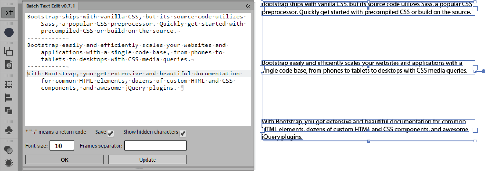

Batch Text Edit v0.7.2
===

###HTML/CSS/JS Extension Panel for Adobe® Illustrator®

###Based on ACE editor

Autor of the original script: [Hiroyuki Sato](http://shspage.com/)
---

[The original script and description here](https://github.com/shspage/illustrator-scripts#batchtexteditjsx)
---

Select text frames and push `Update`

Edit text and push `OK`

Options
---
 * Custom `Frames separator` in editor window
 * `Save` settings flag
 * `Show hidded characters` flag
 * Custom `Font size` in editor window
