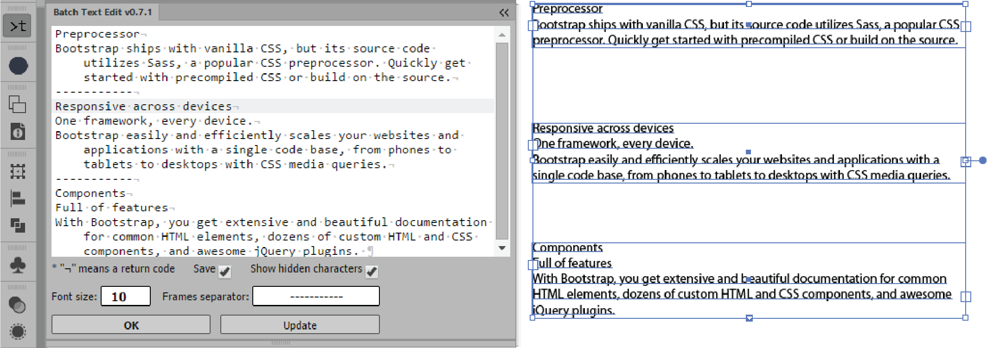

#Batch Text Edit v0.5
##HTML/CSS/JS Extension Panel for Adobe® Illustrator®
###Autor of the original script: [Hiroyuki Sato](http://shspage.com/)
####[The original script and description here](https://github.com/shspage/illustrator-scripts#batchtexteditjsx)
Select text frames and push `Refresh`

Edit text and push `Replace`

